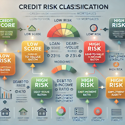

### The Analysis

In this analysis, we used machine learning to predict the likelihood of a loan being classified as low-risk or high-risk. The objective was to enable financial institutions to make informed decisions by evaluating potential risks associated with loan applicants.

The dataset includes various financial features such as `loan_size`, `borrower_income`, `total_debt`, `interest_rate`, `debt_to_income` ratio, and credit history metrics like `num_of_accounts` and `derogatory_marks`. The target variable, `loan_status,` indicates whether a loan application is healthy (`0`) or high-risk (`1`). Our analysis focused on predicting this `loan_status` based on the other features.

### The machine learning process consisted of:

* **Data Preprocessing**: We cleaned and prepared the data by handling missing values, encoding categorical variables, and standardizing numerical data to ensure all features were suitable for model training.
* **Data Splitting**: To validate model performance, we split the data into training and testing sets using `train_test_split`.
* **Model Selection**: We used a `LogisticRegression` model because it is interpretable and suitable for binary classification problems.
* **Evaluation**: We used metrics like the confusion matrix, balanced accuracy, precision, recall, and F1-score to assess the model's ability to classify loan applications correctly.

### Results

* **Logistic Regression Model:**
    * **Accuracy**: 99.26%
    * **Precision (Healthy Loans)**: 99%
    * **Recall (Healthy Loans)**: 100%
    * **F1 Score (Healthy Loans)**: 99.5%
    * **Precision (High-Risk Loans)**: 85%
    * **Recall (High-Risk Loans)**: 94%
    * **F1 Score (High-Risk Loans)**: 89%
 
      
    #### The confusion matrix and balanced accuracy score indicate that the model performed exceptionally well identifying healthy loans while maintaining solid precision for high-risk loans.

### Additional data analysis Results

* **                 Metric         Value
   * **0          Loan Size Average   9806
   * **1           Loan Size Median   9500
   * **2      Interest Rate Average      7
   * **3       Interest Rate Median      7
   * **4    Borrower Income Average  49222
   * **5     Borrower Income Median  48100
   * **6     Number of Accounts Low      1
   * **7    Number of Accounts High     16
   * **8         Average Total Debt  19222

     
### Summary

The **Logistic Regression** model was highly influential in predicting healthy and high-risk loans, achieving an accuracy of 99.26% and a balanced accuracy score of 94%. 

* **Best Performance**: The model predicted healthy loans (0), as indicated by its near-perfect recall and precision scores. However, the slightly lower precision for high-risk loans (1) suggests that the model occasionally needs to be more accurate to classify some risky applications as healthy.
* **Recommendation**: Given the high precision and recall for both classes, the model is well-suited for applications where it is crucial to avoid falsely approving risky loans. The model's high recall ensures that most high-risk loans are correctly identified.
* **Model Choice Justification**: If avoiding risky loans is a priority, the logistic regression model's high precision is beneficial. However, if the goal is to ensure that many eligible borrowers are approved, a model with even higher recall might be considered.

### Visualization

We plotted a 3D graph representing each class's precision, recall, and F1 scores (healthy and high-risk loans) to visualize the classification performance. This visualization helps us understand the trade-offs between precision and recall in predicting loan status. 

Additionally, we plotted a 2D line chart to show the trends of the classification metrics, making it easier to interpret the model's effectiveness across different categories. These visualizations offer insights into the model's performance in various scenarios and help fine-tune loan approval decision-making strategies. 

### Overview of the Analysis

### Explain the purpose of the analysis: 
The report details that the purpose was to use machine learning to predict the likelihood of a loan being classified as low-risk or high-risk, helping financial institutions make better lending decisions.

### Explain what financial information the data was on and what you needed to predict: 
The report mentions that the data includes financial features like loan_size, borrower_income, total_debt, and other metrics. The target variable is loan_status (0 for healthy loans and 1 for high-risk loans).
Provide basic information about the variables you were trying to predict: While it doesn't explicitly provide value_counts, it mentions the primary target variable (loan_status) and provides context for the other features.

### Describe the stages of the machine learning process: 
The report breaks down the analysis into preprocessing, splitting data, model selection, and evaluation.
Briefly touch on any methods you used: The paper specifies LogisticRegression as the chosen model and explains why it was selected.

Results

The report uses bullet points to describe the accuracy, precision, and recall scores for the logistic regression model:

It provides detailed results for accuracy (99.26%), precision, recall, and F1 scores for both healthy and high-risk loans.

### Summary
### Summarize the results of the machine learning models: 

The report highlights that the LogisticRegression model performs exceptionally well in predicting healthy loans and effectively identifies high-risk loans.
Include a recommendation on the model to use: It recommends the logistic regression model due to its balance between precision and recall.

### Does performance depend on the problem we are trying to solve?: 
The report discusses how precision is critical when avoiding risky loans and how recall is vital for approving as many eligible loans as possible, depending on the institution's priorities.

